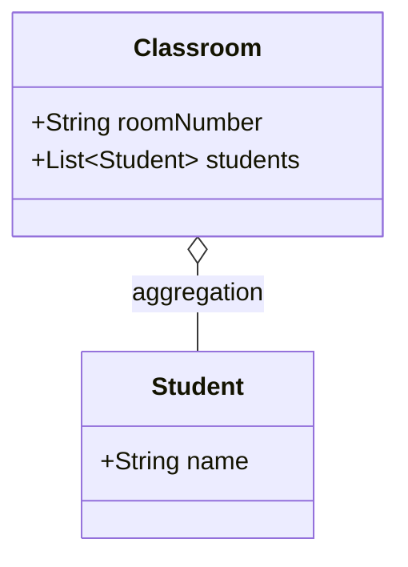

```mermaid
classDiagram
    class Classroom {
        +String roomNumber
        +List~Student~ students
    }
    class Student {
        +String name
    }
    Classroom o-- Student : aggregation
```
