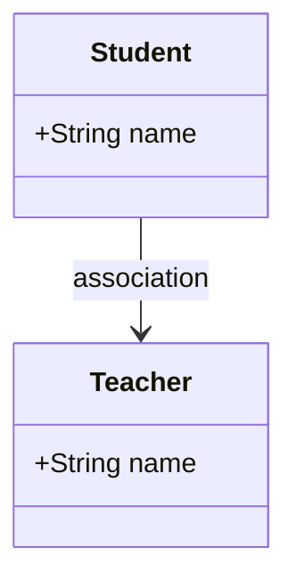

```java
class Classroom {
    String roomNumber;
    List<Student> students; // Agregación con la clase Student
}

class Student {
    String name;
}
```

```mermaid
classDiagram
    class Student {
        +String name
    }
    class Teacher {
        +String name
    }
    Student --> Teacher : association
```

