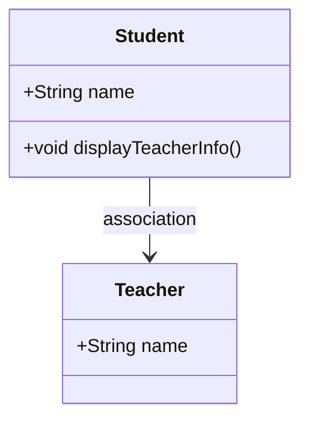

```java
class Student {
    String name;
    Teacher teacher; // Asociación con la clase Teacher

    void displayTeacherInfo() {
        System.out.println("Assigned Teacher: " + teacher.name);
    }
}

class Teacher {
    String name;
}
```


