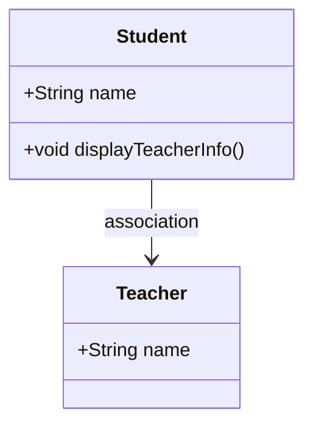
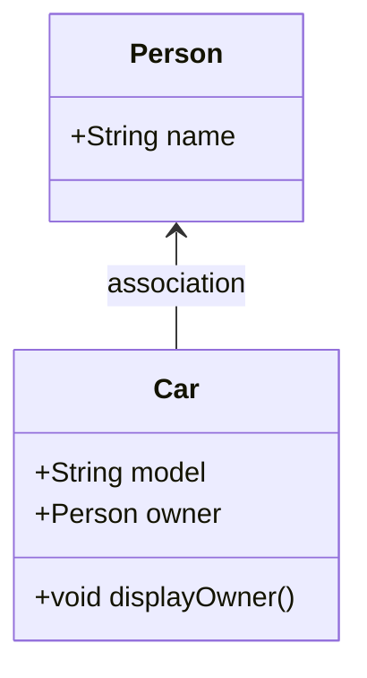

## Ejemplo 1:

```java
class Student {
    String name;
    Teacher teacher; // Asociación con la clase Teacher

    void displayTeacherInfo() {
        System.out.println("Assigned Teacher: " + teacher.name);
    }
}

class Teacher {
    String name;
}
```


## Ejemplo 2:

```java
class Person {
    private String name;

    Person(String name) {
        this.name = name;
    }
}

class Car {
    private String model;
    private Person owner;

    Car(String model, Person owner) {
        if (owner == null) {
            throw new IllegalArgumentException("Owner is required");
        }
        if (model == null || model.isEmpty()) {
            throw new IllegalArgumentException("Model is required");
        }
        this.model = model;
        this.owner = owner;
    }

    void displayOwner() {
        System.out.println(model + " is owned by " + owner.getName());
    }
}

public class Main {
    public static void main(String[] args) {
        Person person = new Person("John");
        Car car = new Car("Tesla Model S", person);

        car.displayOwner();
    }
}
```

