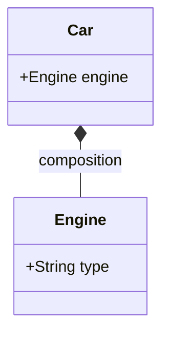

```java
class Car {
    Engine engine; // Composición con la clase Engine

    Car() {
        this.engine = new Engine(); // El motor pertenece al coche
    }
}

class Engine {
    String type;
}
```

