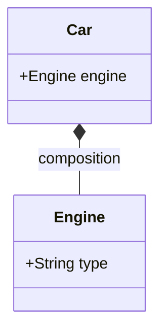

```java
class Car {
    Engine engine; // Composición con la clase Engine
    List<Seat> seats;

    Car() {
        this.engine = new Engine(); // El motor pertenece al coche
        seats.add(new Seat("Leather"));
        seats.add(new Seat("Leather"));
    }
}

class Engine {
    String type;
}

class Seat {
    String type;

    Seat(String type) {
        this.type = type;
    }
}
```

