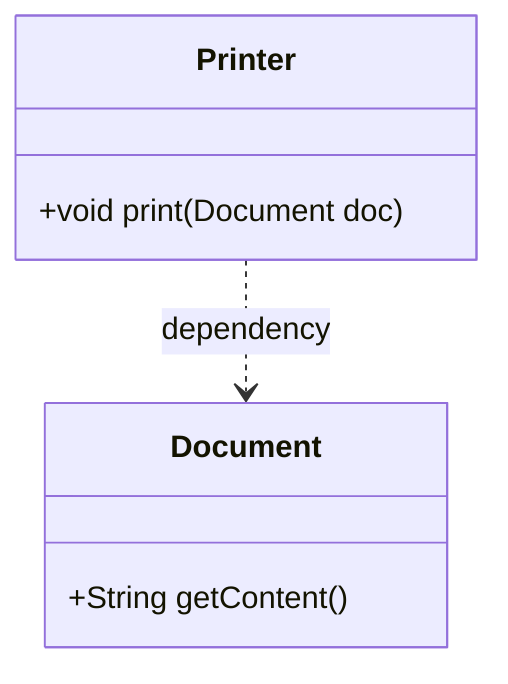

```java
class Printer {
    void print(Document doc) {
        System.out.println("Printing: " + doc.getContent());
    }
}

class Document {
    String getContent() {
        return "Document Content";
    }
}
```

