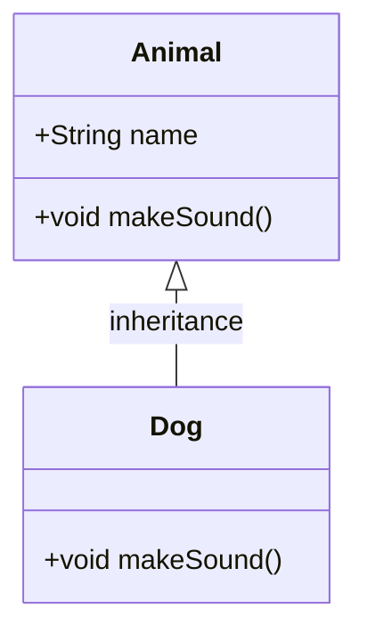

```java
class Animal {
    String name;
    void makeSound() {}
}

class Dog extends Animal {
    void makeSound() {
        System.out.println("Woof");
    }
}
```

```mermaid
classDiagram
    class Animal {
        +String name
        +void makeSound()
    }
    class Dog {
        +void makeSound()
    }
    Animal <|-- Dog : inheritance
```
